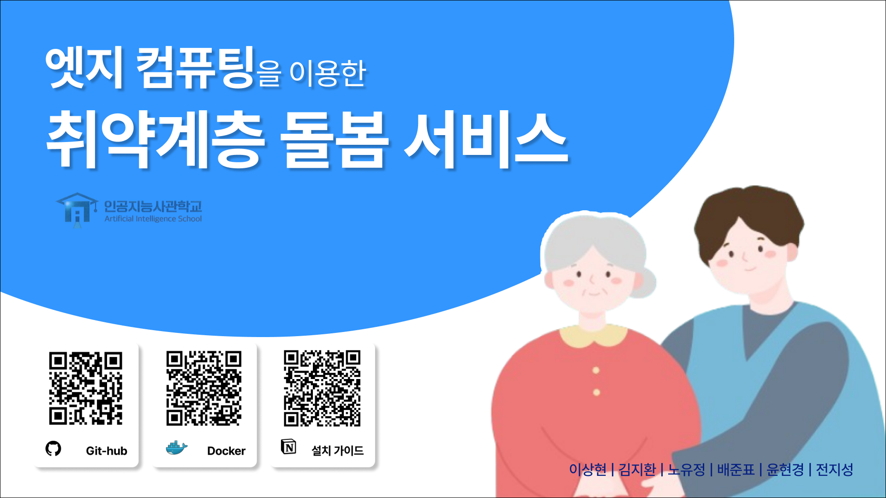
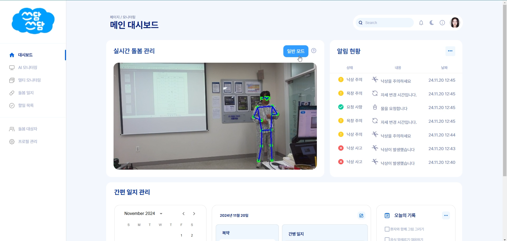
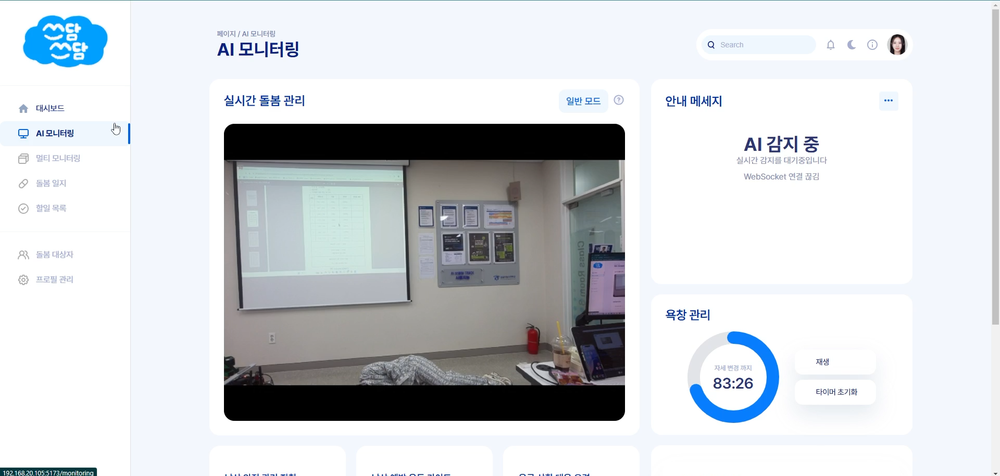
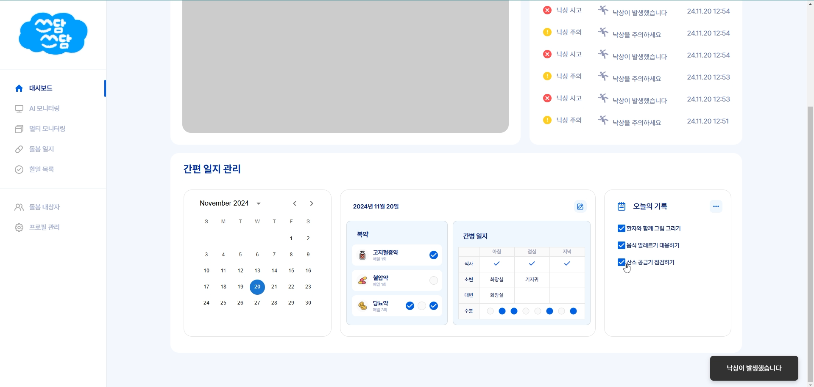
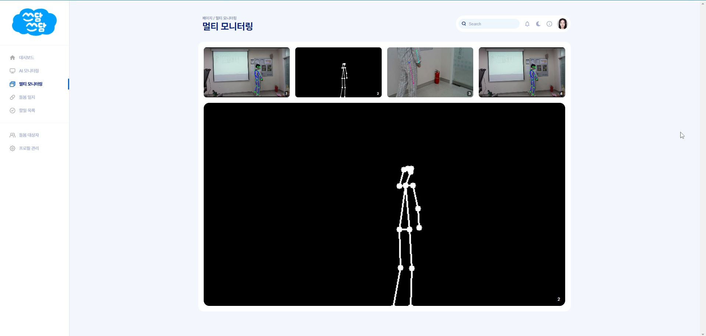

# 엣지 컴퓨팅을 이용한 취약계층 돌봄 서비스
AI와 엣지 컴퓨팅을 활용하여 취약계층의 안전을 보장하는 맞춤형 돌봄 서비스입니다. 실시간 자세 분석, 위험 감지, 사생활 보호 기능과 더불어 낙상, 욕창 등 위험 상황에 신속히 대응할 수 있습니다.

## 데모
- 주요 기능 이미지:

<table>
  <tr>
    <td align="center"></td>
    <td align="center"></td>
  </tr>
  <tr>
    <td align="center"></td>
    <td align="center"></td>
  </tr>
</table>

## 주요 기능 (Features)
- **실시간 자세 분석**: Yolo v8을 활용하여 사용자의 자세와 동작 변화를 실시간으로 감지.
- **행동 인식**: 객체인식된 키포인트의 이동평균, y축 하락량, 바운딩 박스의 상태를 통해 이상 행동(낙상, 욕창 등)을 정확히 탐지.
- **개인정보 보호**: 비식별화, 블러 처리 및 로컬 네트워크 통신을 통해 개인정보 유출 최소화.
- **일상 기록 관리**: 외부 리모컨을 활용하여 간단히 식사, 약물 복용 등을 기록.
- **Docker 환경 지원**: 효율적인 배포를 위한 Docker 기반 서비스.

## 설치 및 실행 방법 (Getting Started)
1. **설치 방법**:
    ```bash
    git clone https://github.com/https://github.com/goraedoll/sseu-dam
    cd final
    npm install
    ```

2. **실행 방법**:
    ```bash
    npm run dev -- --host 'your_ip'
    ```

3. **백엔드 실행**:
      ```bash
      cd back
      uvicorn main:app --host 'your_ip' --port 1252 --reload
      ```

## 기술 스택 (Tech Stack)
- **프론트엔드**: React.js
- **백엔드**: FastAPI
- **AI 모델**: Yolo v8, posenet
- **하드웨어**: raspberry pi 5, Jetson Nano, Arduino ESP32
- **데이터베이스**: mySQL
- **배포 환경**: Docker github


## 팀원 및 역할 (Contributors)
| 이름     | 역할                     |
|----------|--------------------------|
| 이상현   | 팀장, 프로젝트 매니저 및 검수, 프론트엔드 |
| 윤현경   | 프론트엔드 (React.js, Figma UI/UX 설계) |
| 노유정   | 백엔드 (엣지 컴퓨터 환경설정, ai 모델링, 알고리즘 개발) |
| 김지환   | 백엔드 (Jetson Nano, Docker) |
| 배준표   | 서버 연결 및 스트리밍 서버 개발, RESTful API 구현 |
| 전지성   | Arduino 리모컨 개발 |

## 연락처 (Contact)
- 문의 사항은 Issues를 통해 남겨주세요.

